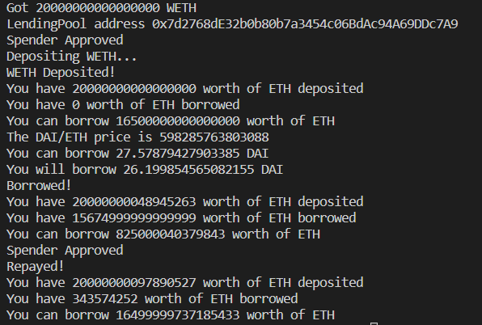

# DeFi

A sample project interacting with the Aave Protocol.

Features:

-   Forks Mainnet to interact with Aave contracts.
-   Converts ETH to WETH.
-   Deposits WETH into the Aave Lending Pool contract.
-   Uses Chainlink Price Feeds to get the DAI/ETH price.
-   Borrows DAI from the Lending Pool.
-   Repays the amount borrowed.

Built with:

-   [@aave/protocol-v2](https://www.npmjs.com/package/@aave/protocol-v2)
-   [@chainlink/contracts](https://www.npmjs.com/package/@chainlink/contracts)
-   [ethers](https://www.npmjs.com/package/ethers)
-   [hardhat](https://www.npmjs.com/package/hardhat)
    -   [@nomiclabs/hardhat-ethers](https://www.npmjs.com/package/@nomiclabs/hardhat-ethers) ([hardhat-deploy-ethers](https://www.npmjs.com/package/hardhat-deploy-ethers))
    -   [hardhat-deploy](https://www.npmjs.com/package/hardhat-deploy)
-   [prettier](https://www.npmjs.com/package/prettier)
    -   [prettier-plugin-solidity](https://www.npmjs.com/package/prettier-plugin-solidity)
-   [dotenv](https://www.npmjs.com/package/dotenv)

## Install

Prerequisites:

-   npm

Install dependencies

```
npm install
```

## Run

Add the mainnet RPC URL in the `.evn` file:

```
MAINNET_RPC_URL=<YOUR-MAINNET-RPC-URL>
```

Run the local hardhat node:

```
npx hardhat node
```

Run the simulation script:

```
npx hardhat run scripts/aaveBorrow.js
```

Output:


